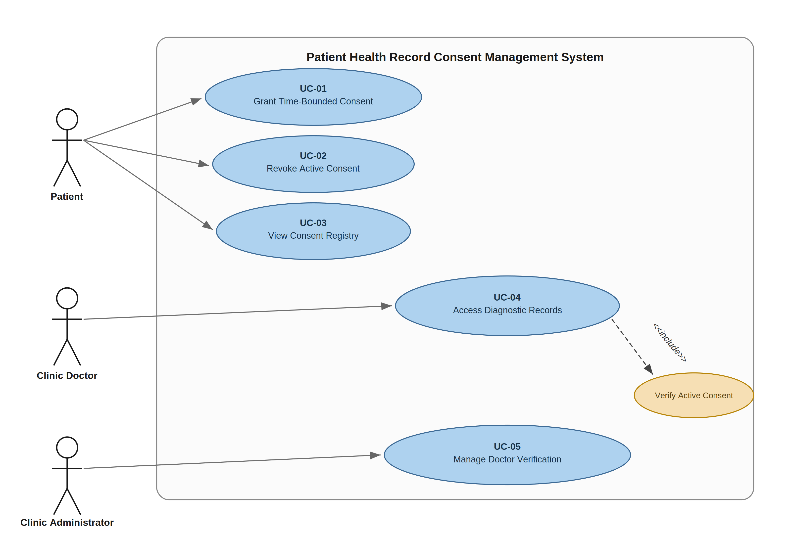

# Software Engineering Lab 1: Requirements Engineering & UML Use-Case Modelling

- **Student Reference Number (SRN)**: PES1UG24CS381
- **Name**: Rohan M
- **Scenario Number**: Scenario 13
- **Project Title**: Patient Health Record Consent Management System (PHRCMS)
- **Primary Domain**: Healthcare & Telemedicine
- **Target Actors**: Patient, Clinic Doctor, Clinic Administrator

---

## 1. Overview & Repository Contents

This directory contains all deliverables for Lab 1:
* `PES1UG24CS381_LAB01.pdf` - Complete Lab 1 submission document in PDF format.
* `PES1UG24CS381_LAB01.docx` - Complete Lab 1 combined Word Document containing the Requirements Table, UML Use-Case Diagram, Traceability Matrix, and Use-Case Flow Specification.
* `requirements.md` - Complete Requirements Specification Table with 5 Functional and 2 Non-Functional Requirements.
* `use-case-flow.md` - Use-Case Flow Specification for `Grant Time-Bounded Consent` with Preconditions, Postconditions, Main Success Scenario, and Alternate Flows.
* `use-case-diagram.png` - UML Use-Case Diagram for PHRCMS.
* `README.md` - Overview and Requirements Traceability Matrix.

---

## 2. Requirements Traceability Matrix

| Requirement | Use Case | Target Actor | Included Verification / Auditing |
| :--- | :--- | :--- | :--- |
| **FR-001** (Grant Consent) | `UC-01: Grant Time-Bounded Consent` | Patient | Patient enters verified doctor and future expiration |
| **FR-002** (Revoke Consent) | `UC-02: Revoke Active Consent` | Patient | Triggers immediate revocation status update |
| **FR-003** (Consent List) | `UC-03: View Consent Registry` | Patient | Real-time status list (active/expired/revoked) |
| **FR-004** (Access Record) | `UC-04: Access Diagnostic Records` | Clinic Doctor | Enforces `UC-06: Verify Active Consent` check |
| **FR-005** (Doctor Verification) | `UC-05: Manage Doctor Verification` | Clinic Administrator | Verification flag managed by clinic administrator |
| **NFR-001** (Audit Trail) | Logging and Auditing | System | Appends to append-only log on grant, revoke, or access |
| **NFR-002** (Response Latency) | `UC-06: Verify Active Consent` | System | Consent validation latency is constrained to < 500ms |

---

## 3. UML Use-Case Model

