# Lab 2: Agile Backlog Creation & Sprint Simulation in Jira

- **Student Reference Number (SRN)**: PES1UG24CS381
- **Name**: Rohan M
- **Scenario Number**: Scenario 13
- **Project Title**: Patient Health Record Consent Management System (PHRCMS)
- **Primary Domain**: Healthcare & Telemedicine
- **Target Actors**: Patient, Clinic Doctor, Clinic Administrator

---

## 1. Objective & Overview

The goal of Lab 2 is to transform the functional requirements identified in Lab 1 into an Agile Scrum product backlog in Jira, estimate effort using the Fibonacci sequence, simulate two sprints, analyze sprint progress via Burndown charts, and reflect on the Agile process.

### Deliverables in this Directory:
* `PES1UG24CS381_LAB02.pdf` / `Software Engineering - LAB 2.pdf` - Complete Lab 2 submission document with all Jira screenshots and reflections.
* `PES1UG24CS381_LAB02.docx` / `Software Engineering - LAB 2.docx` - Editable Word document of the submission.
* `README.md` - Complete markdown documentation with Agile backlog breakdown, sprint simulations, reflection answers, and screenshot references.
* `*.png` - High-resolution captures of Jira Epics, Backlog, Sprint Boards, and Burndown Chart.

---

## 2. Epics & User Stories Breakdown

Functional requirements from Lab 1 are categorized into **3 Epics** and **6 User Stories** adhering to standard Agile syntax (`As a [role], I want [goal], So that [benefit]`).

### **Epic 1: Consent Management**
*Description: Enable patients to grant, monitor, and revoke time-bounded access permissions to their diagnostic records.*

| Story ID | User Story | Priority | Story Points | Sprint |
| :--- | :--- | :--- | :---: | :---: |
| **US-01** (FR-001) | **As a** Patient, **I want to** grant time-bounded access permissions for specific diagnostic records to verified clinic doctors with an expiration date and time, **so that** I can share health data temporarily while minimizing exposure risk. | High | 5 | Sprint 1 |
| **US-02** (FR-002) | **As a** Patient, **I want to** revoke any active consent permission at any time prior to its scheduled expiration, **so that** I maintain real-time control over my sensitive medical data. | High | 3 | Sprint 1 |
| **US-03** (FR-003) | **As a** Patient, **I want to** view a real-time list of all active and expired consent permissions, **so that** I can audit who currently has access to my health records. | Medium | 3 | Sprint 2 |

---

### **Epic 2: Secure Health Record Access**
*Description: Ensure authorized clinic doctors can access medical records strictly under valid, active consent with full audit logging.*

| Story ID | User Story | Priority | Story Points | Sprint |
| :--- | :--- | :--- | :---: | :---: |
| **US-04** (FR-004) | **As a** Clinic Doctor, **I want to** access authorized patient diagnostic records only when an active, unexpired consent is in place, **so that** I can provide timely medical diagnosis without violating data privacy policies. | High | 5 | Sprint 1 |
| **US-05** (NFR-001 / NFR-002) | **As a** System Auditor / Compliance Officer, **I want** all consent grants, revocations, and access attempts permanently written to an append-only audit trail with low latency (<500ms), **so that** the clinic remains compliant with medical regulations. | High | 3 | Sprint 1 |

---

### **Epic 3: Doctor Verification**
*Description: Provide administrative capabilities to manage and verify medical professionals within the system registry.*

| Story ID | User Story | Priority | Story Points | Sprint |
| :--- | :--- | :--- | :---: | :---: |
| **US-06** (FR-005) | **As a** Clinic Administrator, **I want to** register and toggle the verification status of clinic doctors, **so that** patients can only grant consent to legitimate, licensed medical practitioners. | Medium | 3 | Sprint 2 |

---

## 3. Backlog Estimation & Story Point Rationale

Story points were estimated using the **Fibonacci scale** (1, 2, 3, 5, 8, 13) using **Planning Poker** techniques:
* **5 Story Points (High Complexity)**: `US-01` (Granting time-bounded consent) and `US-04` (Enforcing consent-controlled record access) involve complex date-time validation, multi-actor permissions, and security checks.
* **3 Story Points (Medium Complexity)**: `US-02` (Revocation), `US-03` (Registry view), `US-05` (Audit logging), and `US-06` (Doctor verification) represent straightforward state updates and filtered queries.

**Total Product Backlog**: **22 Story Points**

---

## 4. Sprint Simulation Summary

### **Sprint 1: Core Consent & Record Access Workflow (16 Story Points)**
* **Sprint Goal**: Implement core consent creation, revocation, doctor access verification, and audit logging.
* **Included Stories**: `US-01` (5 SP), `US-02` (3 SP), `US-04` (5 SP), `US-05` (3 SP)
* **Lifecycle Progression**: All 4 stories successfully transitioned: `To Do` $\rightarrow$ `In Progress` $\rightarrow$ `Done`.
* **Outcome**: 16 / 16 Story Points completed on schedule.

### **Sprint 2: Visibility, Registry & Administrative Verification (6 Story Points)**
* **Sprint Goal**: Deliver patient consent registry UI and administrative doctor verification features.
* **Included Stories**: `US-03` (3 SP), `US-06` (3 SP)
* **Lifecycle Progression**: All stories successfully moved to `Done`.
* **Outcome**: 6 / 6 Story Points completed, delivering 100% of product backlog.

---

## 5. Burndown Chart Analysis & Insights

The Jira Burndown Chart tracks the remaining effort (Story Points) against the guideline over the course of the sprint.

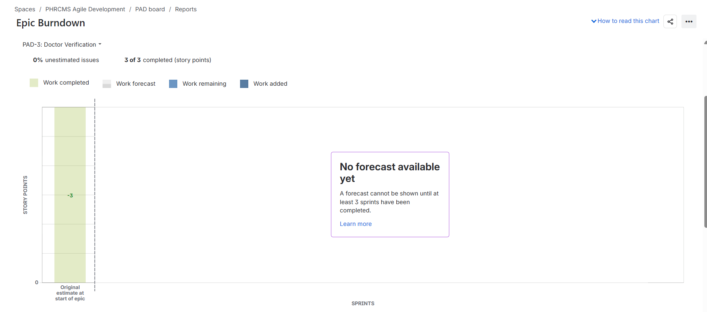

* **Planned Points**: 16 Story Points (Sprint 1)
* **Burndown Behavior**: Stepwise reduction as stories were completed and moved to `Done`.
* **Observations**: Progress tracked closely with the linear guideline, confirming realistic sprint capacity planning and clean task breakdown.

---

## 6. Answers to Reflection Questions

### 1. Did your estimations reflect the actual effort?
> The estimates generally reflected the relative complexity of the work. The larger stories, such as granting consent (`US-01`) and accessing diagnostic records (`US-04`), were assigned **5 story points** because they involve more validation and access-control logic. Smaller stories such as viewing the consent registry (`US-03`) and managing doctor verification (`US-06`) were assigned **3 points**. Since this was a simulated sprint, the story-point estimates were mainly useful for comparing relative effort and uncertainty rather than measuring absolute hours.

### 2. Was your backlog well-prioritized?
> **Yes.** The backlog prioritized core consent and health-record access functionality first because these functions are fundamental to the system's mission and data privacy obligations. Granting consent and accessing diagnostic records were prioritized as **High** (Sprint 1), followed by revocation and audit control. Supporting functions such as viewing the consent registry and managing doctor verification were prioritized as **Medium** (Sprint 2).

### 3. How did your simulated sprint align with your plan?
> Sprint 1 focused on the core consent and record-access workflow and contained **16 story points**. Sprint 2 completed the remaining consent visibility and doctor verification functionality with **6 story points**. The user stories moved sequentially from `To Do` to `In Progress` and then `Done` to simulate the development workflow. Overall, the sprint structure followed the planned backlog prioritization accurately without scope creep.

### 4. What insights did the burndown chart give about your team's capacity?
> The burndown chart provided a clear visual representation of how quickly the planned story points were burned down during the sprint. It helped compare actual progress with the ideal guideline and demonstrated how remaining work decreased as stories were completed. In a full production environment, consistent burndown patterns confirm accurate estimation velocity, while sudden flatlines or drops help identify bottlenecks or oversized stories.

---

## 7. Jira Artifacts & Screenshots

| Phase / Step | Screenshot Preview |
| :--- | :--- |
| **Epic Creation** | 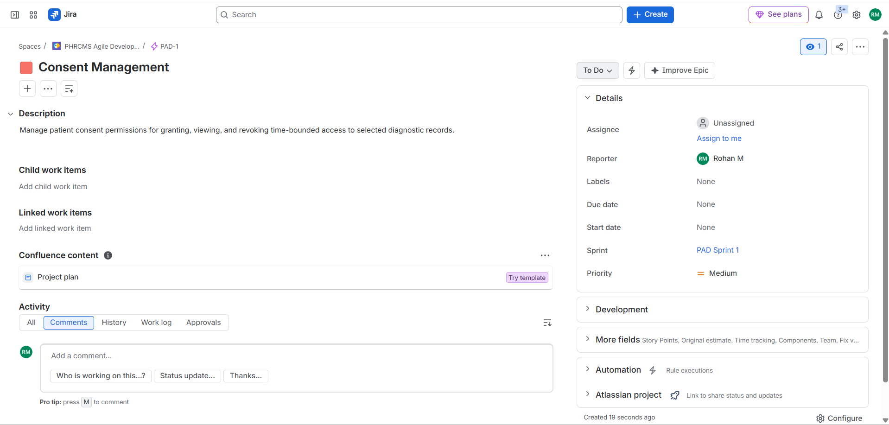 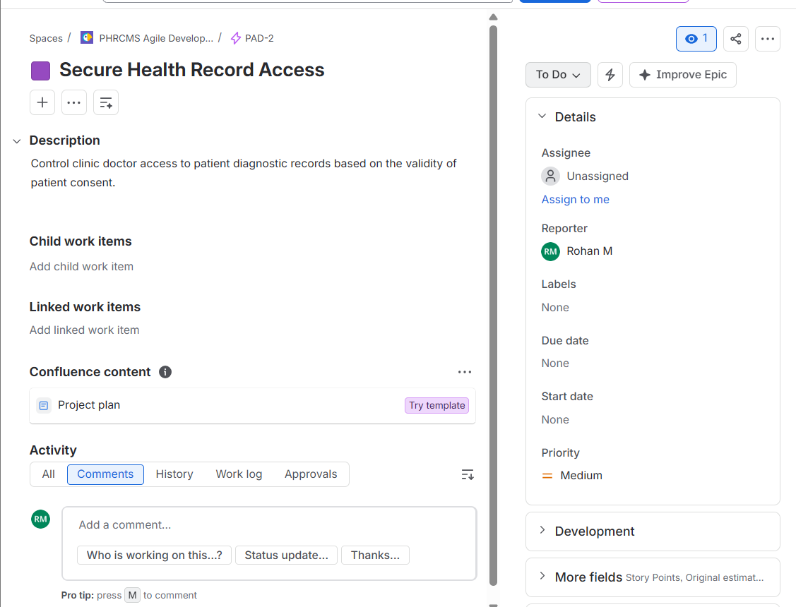 |
| **All Epics Overview** | 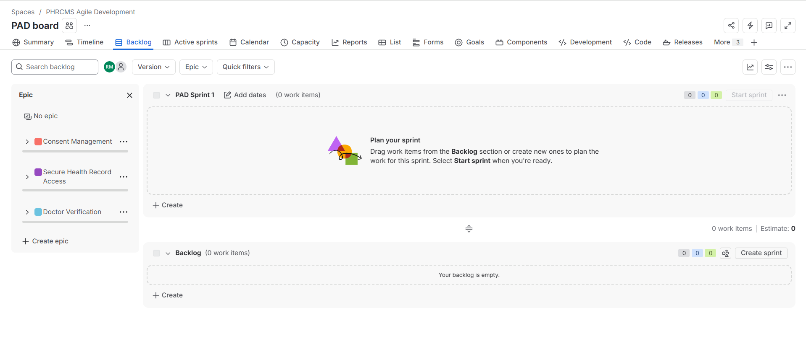 |
| **Complete Backlog** | 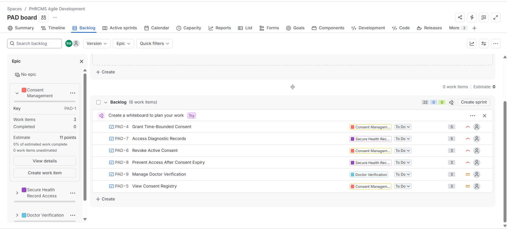 |
| **Prioritized Backlog** | 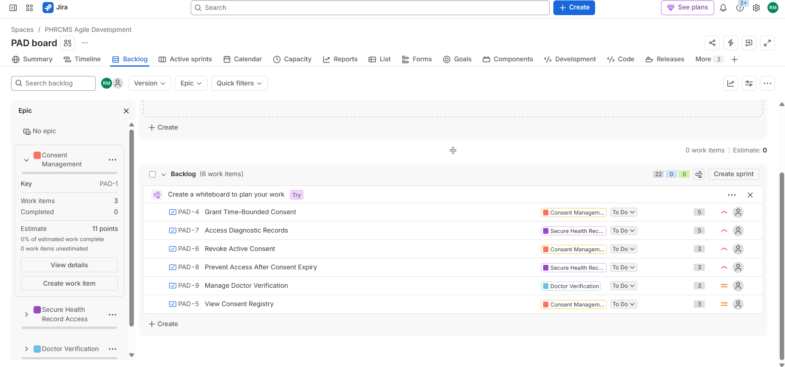 |
| **Story Points Assigned** | 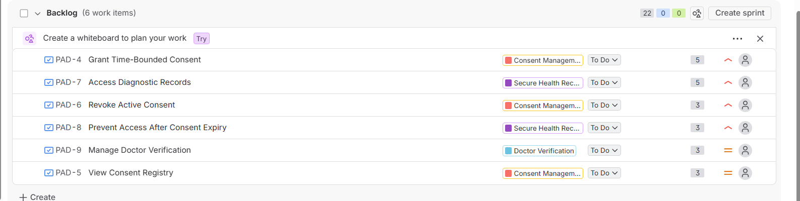 |
| **Sprint 1 Planning** | 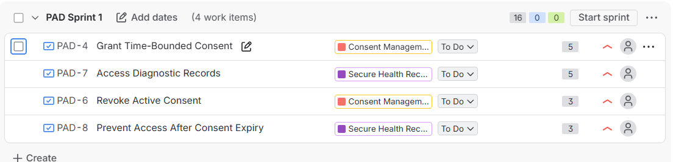 |
| **Sprint 1 Active Board (To Do)** | 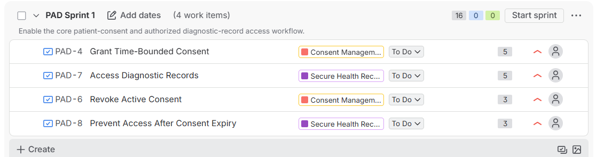 |
| **Sprint 1 Active Board (Progress)** | 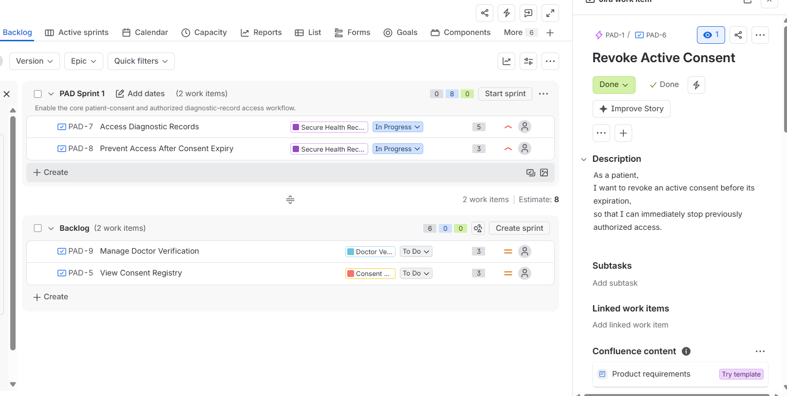 |
| **Sprint 1 Completed** | 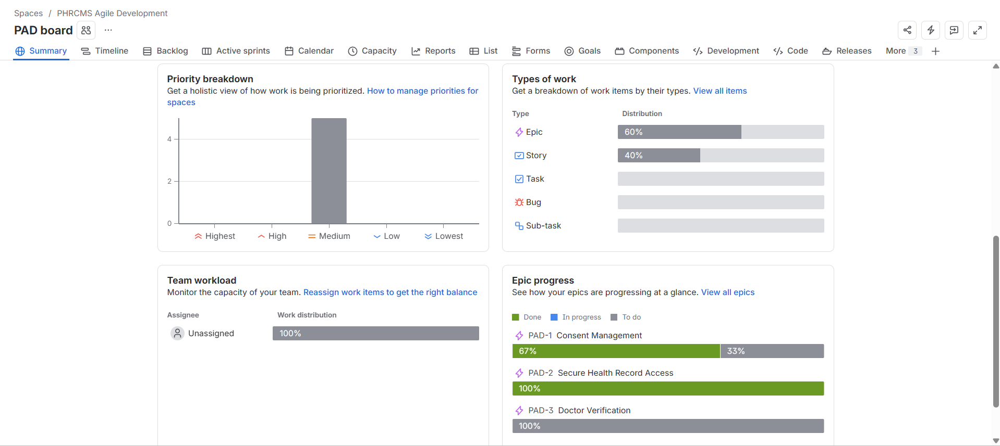 |
| **Sprint 2 Planning** | 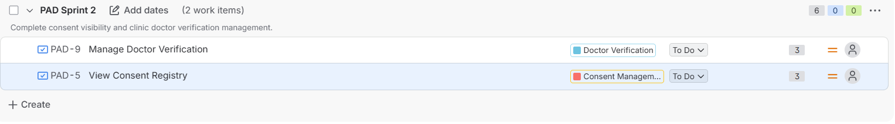 |
| **Sprint 2 Active Board (To Do)** |  |
| **Sprint 2 Active Board (Progress)** | 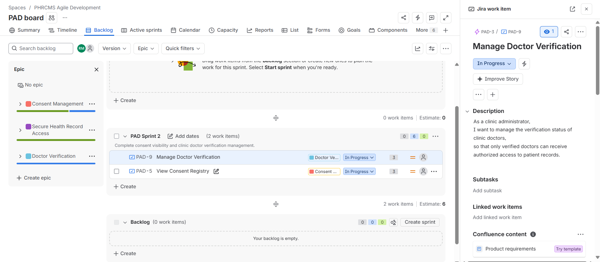 |
| **Sprint 2 Completed** | 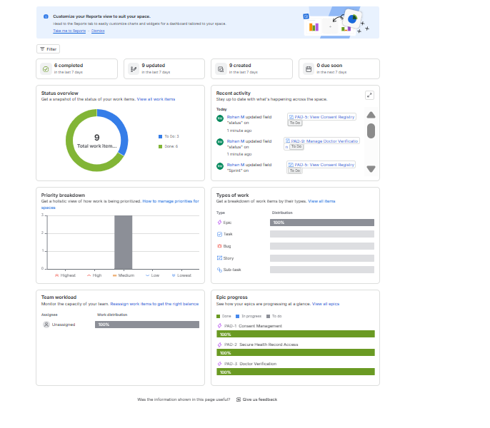 |
| **Burndown Chart** |  |
