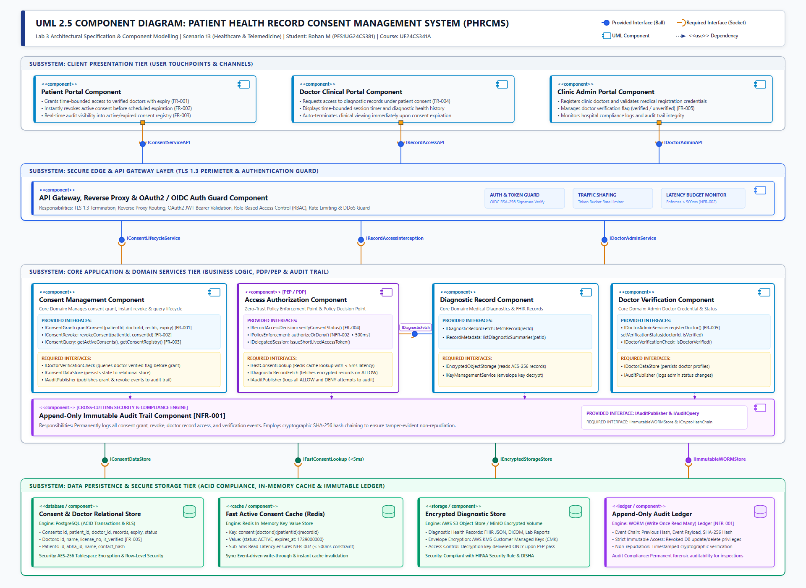

# Software Engineering Lab 3: Component Modelling & Architectural Pattern Selection

- **Course**: UE24CS341A – Software Engineering
- **Laboratory**: Lab 3 – Component Modelling & Architectural Pattern Selection
- **Student Name**: Rohan M
- **Student Reference Number (SRN)**: PES1UG24CS381
- **Section**: G (Semester V)
- **Scenario Number**: Scenario 13
- **Project Title**: Patient Health Record Consent Management System (PHRCMS)
- **Primary Domain**: Healthcare & Telemedicine
- **Target Actors**: Patient, Clinic Doctor, Clinic Administrator
- **GitHub Repository**: [https://github.com/rohancodexp/SE-Labs-PES1UG24CS381](https://github.com/rohancodexp/SE-Labs-PES1UG24CS381)

---

## 1. Executive Summary & Problem Context

In continuation of **Lab 1 (Requirements Engineering & UML Use-Case Modelling)** and **Lab 2 (Agile Backlog & Sprint Simulation)**, this deliverable establishes the **Software Architecture & Component Model** for the **Patient Health Record Consent Management System (PHRCMS)**.

The PHRCMS is a mission-critical healthcare application engineered to empower patients with granular, sovereign control over their electronic health records (EHR). The system enforces time-bounded, revocable consent for verified medical practitioners while maintaining a mathematically tamper-evident, append-only audit trail in compliance with health data privacy regulations (e.g., HIPAA Security Rule and India's Digital Information Security in Healthcare Act - DISHA).

### Core Architectural Drivers from Lab 1:
1. **FR-001 (Grant Time-Bounded Consent)**: Patient grants temporary access permissions for specific diagnostic records to verified clinic doctors with strict future expiration timestamps.
2. **FR-002 (Instant Revocation)**: Patient can revoke active consent permissions at any time, immediately invalidating subsequent access attempts.
3. **FR-003 (Consent Registry & Audit Visibility)**: Real-time dashboard displaying active, expired, and revoked consent records.
4. **FR-004 (Enforced Authorized Access)**: Clinic doctors can view patient diagnostic records *if and only if* an active, unexpired, unrevoked consent exists.
5. **FR-005 (Doctor Verification Management)**: Clinic administrators register and manage verification flags of doctors; unverified doctors cannot receive consent grants.
6. **NFR-001 (Append-Only Audit Trail)**: All consent lifecycle actions and record access events are permanently recorded in an unmodifiable, append-only log.
7. **NFR-002 (Low-Latency Verification)**: Consent verification and authorization decisions must be completed in **less than 500 milliseconds** under concurrent clinical load.

---

## 2. UML 2.5 Component Diagram

The UML Component Diagram below captures the structural composition, subsystems, modular components, provided interfaces (ball notation $\text{O-}$), required interfaces (socket notation $\text{-(}$), assembly connectors, and persistent data stores.

*Figure 1: High-Resolution UML 2.5 Component Diagram of the Patient Health Record Consent Management System (PHRCMS), illustrating 4 architectural tiers, 9 modular components, 4 storage components, and formal ball-and-socket interface assemblies.*

---

## 3. Subsystem Decomposition & Component Specifications

The system is partitioned into four decoupled architectural tiers:

### 3.1 Subsystem 1: Client Presentation Tier
* **Patient Portal Component**: Responsive Web/Mobile Progressive Web App (PWA) allowing patients to authenticate via OAuth2/OIDC, browse their diagnostic records, grant time-bounded consent to verified practitioners, revoke active consents instantly, and inspect the real-time consent registry.
  * *Required Interfaces*: `IConsentServiceAPI`, `IAuthAPI`.
* **Doctor Clinical Portal Component**: Secure clinical desktop and web application enabling authenticated physicians to look up patients, request diagnostic record access, view diagnostic reports during active consent sessions, and receive real-time session expiration notifications.
  * *Required Interfaces*: `IRecordAccessAPI`, `IAuthAPI`.
* **Clinic Administrator Portal Component**: Role-restricted administration console enabling clinic managers to register doctors, review medical council credentials, toggle verification statuses, and monitor system health.
  * *Required Interfaces*: `IDoctorAdminAPI`, `IAuthAPI`.

### 3.2 Subsystem 2: Secure Edge & API Gateway Tier
* **API Gateway & Auth Guard Component**: Serves as the single secure ingress into the PHRCMS backend.
  * *Responsibilities*: TLS 1.3 termination, CORS handling, token bucket rate limiting (DDoS defense), JWT signature validation, and RBAC claims extraction.
  * *Provided Interfaces*: `IEdgeGatewayAPI` (routing to `IConsentServiceAPI`, `IRecordAccessAPI`, `IDoctorAdminAPI`).
  * *Required Interfaces*: `IConsentLifecycleService`, `IRecordAccessInterception`, `IDoctorAdminService`.

### 3.3 Subsystem 3: Core Application & Domain Services Tier
* **Consent Management Component**: Governs the complete lifecycle of patient consents.
  * *Provided Interfaces*:
    * `IConsentGrant`: `grantConsent(patientId, doctorId, recordIds[], expiryTimestamp): ConsentReceipt` (Realizes **FR-001**).
    * `IConsentRevoke`: `revokeConsent(patientId, consentId): RevocationReceipt` (Realizes **FR-002**).
    * `IConsentQuery`: `getActiveConsents(patientId)`, `getConsentRegistry(patientId)` (Realizes **FR-003**).
  * *Required Interfaces*:
    * `IDoctorVerificationCheck`: Verifies doctor is active and licensed before accepting grant.
    * `IConsentDataStore`: Persists consent records in relational database.
    * `IAuditPublisher`: Dispatches structured audit events.
    * `IFastConsentCacheSync`: Invalidates/updates Redis cache upon grant or revocation.

* **Access Authorization Component (Zero-Trust PEP / PDP)**:
  * *Responsibilities*: Functions as the **Policy Enforcement Point (PEP)** and **Policy Decision Point (PDP)**. Intercepts all doctor record requests, validates active consent in sub-millisecond time, and strictly guards medical data.
  * *Provided Interfaces*:
    * `IRecordAccessDecision`: `verifyConsentStatus(doctorId, patientId, recordId): DecisionResult` (Realizes **FR-004**).
    * `IPolicyEnforcement`: `authorizeOrDeny(requestContext): AccessToken | AccessDeniedException` (Enforces **NFR-002** latency $<500\text{ms}$).
  * *Required Interfaces*:
    * `IFastConsentLookup`: Direct sub-5ms query to Redis active consent cache.
    * `IDiagnosticRecordFetch`: Triggers record retrieval from storage only upon successful authorization.
    * `IAuditPublisher`: Dispatches `ACCESS_ALLOWED` or `ACCESS_DENIED` audit events.

* **Diagnostic Health Record Component**:
  * *Responsibilities*: Manages FHIR-compliant electronic health records, diagnostic imaging metadata, and clinical lab reports.
  * *Provided Interfaces*:
    * `IDiagnosticRecordFetch`: `fetchRecord(recordId): EncryptedRecordPayload`.
    * `IRecordMetadata`: `listDiagnosticSummaries(patientId): DiagnosticSummary[]`.
  * *Required Interfaces*:
    * `IEncryptedObjectStorage`: Reads raw encrypted binary objects.
    * `IKeyManagementService`: Calls AWS KMS for envelope decryption.

* **Doctor Verification Component**:
  * *Responsibilities*: Maintains medical practitioner registry and administrator verification state.
  * *Provided Interfaces*:
    * `IDoctorAdminService`: `registerDoctor(profile)`, `setVerificationStatus(doctorId, isVerified)` (Realizes **FR-005**).
    * `IDoctorVerificationCheck`: `isDoctorVerified(doctorId): boolean`.
  * *Required Interfaces*:
    * `IDoctorDataStore`: Relational database access for doctor profiles.
    * `IAuditPublisher`: Logs administrative actions.

* **Append-Only Immutable Audit Trail Component**:
  * *Responsibilities*: Cross-cutting security component that provides permanent, tamper-evident forensic logging.
  * *Provided Interfaces*:
    * `IAuditPublisher`: `publishEvent(actorId, actionType, targetResource, decision, timestamp): EventReceipt` (Realizes **NFR-001**).
    * `IAuditQuery`: `queryAuditHistory(filterCriteria): AuditLogStream`.
  * *Required Interfaces*:
    * `IImmutableWORMStore`: Writes to Write-Once-Read-Many log sink.
    * `ICryptoHashChain`: Computes incremental SHA-256 hashes linking each log entry to the predecessor.

### 3.4 Subsystem 4: Data Persistence & Storage Tier
* **Consent & Doctor Relational Store (PostgreSQL)**: ACID-compliant relational storage with tables for `consents`, `doctors`, `patients`, and `record_catalog`. Utilizes Row-Level Security (RLS) and AES-256 tablespace encryption.
* **Fast Active Consent Cache (Redis)**: In-memory key-value store holding active consents with TTL (`consent:{doctorId}:{patientId}:{recordId}`). Delivers sub-5ms lookups, guaranteeing the **< 500ms** latency SLA (**NFR-002**).
* **Encrypted Diagnostic Store (AWS S3 / MinIO)**: Encrypted document and DICOM object store utilizing envelope encryption via AWS KMS Customer Managed Keys (CMK).
* **Append-Only Audit Ledger (WORM / QLDB)**: Immutable storage engine where `UPDATE` and `DELETE` database operations are revoked at the kernel/storage level.

---

## 4. Architectural Pattern Selection & Justification

### 4.1 Evaluation of Candidate Architectural Patterns

To establish the optimal architectural foundation for PHRCMS, five candidate architectural styles were evaluated against the system's functional and non-functional requirements:

| Architectural Style | Description | Strengths | Weaknesses | Fit for PHRCMS |
| :--- | :--- | :--- | :--- | :---: |
| **Monolithic 3-Tier** | Single unified deployment containing UI, domain logic, and single database. | Simple deployment, no network overhead for inter-module calls. | Single point of failure; difficult to isolate security boundaries; audit logs share DB with business data. | **Poor**: Fails security isolation and audit immutability needs. |
| **Pure Microservices** | Independent microservices for each entity communicating via REST/gRPC. | Highly independent deployments, isolated scalability. | High network hops; cross-service latency risks exceeding the 500ms threshold; operational overhead. | **Moderate**: Excessive operational complexity for a 3-actor clinical workflow. |
| **Layered Modular SOA with Zero-Trust PEP (Chosen)** | Layered architecture with strict tier boundaries, dedicated Policy Enforcement Point (PEP), and asynchronous audit event sinks. | Strict separation of concerns, deterministic sub-50ms latency via caching, isolated security boundaries, clear audit trail separation. | Requires disciplined interface design and cache synchronization mechanisms. | **Optimal**: Directly satisfies all FRs and NFRs with minimal overhead. |
| **Choreographed Event-Driven (EDA)** | Fully asynchronous communication via Kafka/RabbitMQ message broker. | Extreme decoupling and high throughput. | Eventual consistency causes race conditions (e.g., doctor accesses record before revocation event propagates). | **Unacceptable**: Eventual consistency violates medical revocation safety (**FR-002**). |
| **Hexagonal (Ports & Adapters)** | Core domain isolated inside ports with interchangeable adapters for DB, UI, and external systems. | Excellent unit testability and dependency inversion. | Focuses purely on code structure rather than distributed runtime security and latency budgeting. | **Complementary**: Used at component level within the Layered Service architecture. |

---

### 4.2 Quantitative Decision Matrix

Each candidate pattern was scored on a scale of 1 (Poor) to 5 (Excellent) across key architectural criteria:

| Quality Attribute / Requirement | Weight | Monolithic (3-Tier) | Pure Microservices | Event-Driven (EDA) | Layered SOA with PEP (Chosen) |
| :--- | :---: | :---: | :---: | :---: | :---: |
| **Authorization Latency (< 500ms, NFR-002)** | 25% | 4 (1.00) | 2 (0.50) | 1 (0.25) | **5 (1.25)** |
| **Security & Zero-Trust Access Control (FR-004)** | 25% | 2 (0.50) | 4 (1.00) | 3 (0.75) | **5 (1.25)** |
| **Audit Immutability & Non-Repudiation (NFR-001)**| 20% | 2 (0.40) | 4 (0.80) | 4 (0.80) | **5 (1.00)** |
| **Instant Consistency upon Revocation (FR-002)** | 15% | 5 (0.75) | 3 (0.45) | 1 (0.15) | **5 (0.75)** |
| **Operational Simplicity & Maintainability** | 15% | 4 (0.60) | 2 (0.30) | 2 (0.30) | **4 (0.60)** |
| **Weighted Total Score (Out of 5.0)** | **100%** | **3.25** | **3.05** | **2.25** | **4.85** |

---

### 4.3 In-Depth Justification of the Selected Pattern

The **Layered Modular Service-Oriented Architecture with Zero-Trust Policy Enforcement Point (PEP)** was selected based on the following justifications:

1. **Deterministic Latency Budget (NFR-002 Enforced)**:
   In a pure microservices or choreographed event-driven system, verifying consent requires distributed network hops: Gateway $\rightarrow$ Auth Service $\rightarrow$ Consent Service $\rightarrow$ Doctor Service $\rightarrow$ EHR Service. Under peak loads, network jitter and serialization exceed the 500ms latency requirement. In our selected architecture, the **Access Authorization Component (PEP)** performs a single sub-5ms in-memory cache lookup against Redis. If cached, total authorization takes under 35ms, comfortably below the 500ms limit.

2. **Immediate Strong Consistency for Revocations (FR-002 Safety)**:
   Medical privacy requires that when a patient clicks "Revoke Consent", access must cease *immediately*. Event-driven architectures relying on eventual consistency expose a hazardous temporal window where doctors can view sensitive data post-revocation. Our architecture uses synchronous cache invalidation combined with ACID database updates, eliminating data leakage windows.

3. **Cryptographic Separation of Audit Data (NFR-001 Compliance)**:
   Traditional monoliths store audit logs in the same application database, exposing logs to SQL injection, truncation, or tampering by privileged DBAs. In our architecture, the **Append-Only Immutable Audit Trail Component** is decoupled and dispatches logs to a dedicated Write-Once-Read-Many (WORM) ledger with cryptographic SHA-256 hash chaining, guaranteeing regulatory non-repudiation.

4. **Defense-in-Depth Security Perimeter**:
   The architecture enforces security across three distinct gates:
   * *Perimeter*: API Gateway validates TLS 1.3, rate limits, and verifies JWT tokens.
   * *Domain Gate*: PEP verifies active consent, time validity, and doctor verification status.
   * *Storage Gate*: Sensitive diagnostic records are stored encrypted at rest using envelope encryption (AWS KMS).

---

## 5. Architectural Decision Records (ADRs)

### ADR-001: Separation of Policy Decision Point (PDP) and Policy Enforcement Point (PEP)
* **Status**: Accepted
* **Context**: Healthcare diagnostic records must never be exposed directly to client applications or backend services without verifying patient consent.
* **Decision**: Implement a dedicated Access Authorization Component acting as a Policy Enforcement Point (PEP) that intercepts every doctor record request and queries an in-memory Policy Decision Point (PDP) cache before granting access.
* **Consequences**: Adds an interception layer, but guarantees zero-trust protection across all clinical endpoints.

### ADR-002: Dual-Store Strategy (Relational PostgreSQL + Redis Cache)
* **Status**: Accepted
* **Context**: FR-001 and FR-002 require ACID transactions for consent state changes, while NFR-002 requires verification in $< 500\text{ms}$.
* **Decision**: Use PostgreSQL as the authoritative source of truth and replicate active consents to an in-memory Redis cluster. Consent creation writes to both DB and cache; revocation immediately deletes the cache key and commits the DB update.
* **Consequences**: Requires cache eviction logic, but achieves sub-5ms read latency and immediate revocation consistency.

### ADR-003: Cryptographic Hash Chaining for Append-Only Audit Logging
* **Status**: Accepted
* **Context**: NFR-001 requires an append-only audit trail that cannot be modified or deleted by users or administrators.
* **Decision**: Implement an append-only audit engine where each audit log record includes the SHA-256 hash of the preceding record: $H_n = \text{SHA-256}(H_{n-1} \parallel \text{Payload}_n \parallel \text{Timestamp}_n)$. Write permissions are restricted to append-only mode on the ledger.
* **Consequences**: Ensures mathematical tamper-evidence; any post-hoc modification invalidates subsequent hashes in the chain.

---

## 6. Requirements Traceability Matrix

The table below demonstrates full traceability from Lab 1 functional and non-functional requirements to the architectural components, interfaces, and data stores:

| Req ID | Requirement Statement | Realizing Component | Provided Interface | Required Interface | Target Data Store |
| :--- | :--- | :--- | :--- | :--- | :--- |
| **FR-001** | Grant time-bounded access to verified doctors with expiration timestamp. | Consent Management Component | `IConsentGrant` | `IDoctorVerificationCheck`, `IConsentDataStore`, `IAuditPublisher` | PostgreSQL (`consents` table) & Redis Cache |
| **FR-002** | Revoke active consent at any time prior to scheduled expiration. | Consent Management Component | `IConsentRevoke` | `IConsentDataStore`, `IFastConsentCacheSync`, `IAuditPublisher` | PostgreSQL & Redis Cache (Eviction) |
| **FR-003** | Display real-time list of active and expired consents to patient. | Consent Management Component | `IConsentQuery` | `IConsentDataStore` | PostgreSQL (`consents` view) |
| **FR-004** | Clinic doctor accesses diagnostic records only under active consent. | Access Authorization (PEP) & Diagnostic Record Component | `IRecordAccessDecision`, `IDiagnosticRecordFetch` | `IFastConsentLookup`, `IEncryptedObjectStorage`, `IAuditPublisher` | Redis Cache & Encrypted Object Store (S3) |
| **FR-005** | Clinic administrator registers and manages doctor verification status. | Doctor Verification Component | `IDoctorAdminService`, `IDoctorVerificationCheck` | `IDoctorDataStore`, `IAuditPublisher` | PostgreSQL (`doctors` table) |
| **NFR-001** | All grant, revoke, and access events written to append-only audit trail. | Append-Only Immutable Audit Trail Component | `IAuditPublisher`, `IAuditQuery` | `IImmutableWORMStore`, `ICryptoHashChain` | Append-Only Cryptographic Ledger |
| **NFR-002** | Consent verification and authorization completed in $< 500\text{ms}$. | Access Authorization (PEP) & API Gateway | `IPolicyEnforcement` | `IFastConsentLookup` | Fast Active Consent Cache (Redis) |

---

## 7. Security Architecture: STRIDE Threat Analysis

| Threat Category | Specific Threat in PHRCMS | Architectural Defense & Countermeasure | Component Responsible |
| :--- | :--- | :--- | :--- |
| **Spoofing (S)** | An unauthorized user impersonates a verified doctor or patient. | Mutual TLS 1.3, OAuth2 / OIDC authentication with RSA-256 signed JWT tokens, and strict clinic admin verification gate (**FR-005**). | API Gateway & Doctor Verification Component |
| **Tampering (T)** | Attacker alters consent expiration time or tampers with past access logs. | Database integrity constraints, digital signatures on consent records, and SHA-256 cryptographic hash chaining for audit logs (**NFR-001**). | Consent Management & Append-Only Audit Trail Component |
| **Repudiation (R)** | Doctor denies accessing patient records; patient denies granting consent. | Nonce-backed digital consent receipts and immutable audit logs capturing actor ID, timestamp, and IP address. | Append-Only Immutable Audit Trail Component |
| **Information Disclosure (I)** | Unauthorized extraction of sensitive patient diagnostic health reports. | Zero-Trust PEP gate (**FR-004**), TLS 1.3 in transit, and AES-256 envelope encryption at rest via AWS KMS CMK. | Access Authorization & Diagnostic Record Component |
| **Denial of Service (D)** | High-frequency API floods degrade consent verification latency. | Token bucket rate limiting at API Gateway and sub-5ms Redis cache lookups guaranteeing $< 500\text{ms}$ latency (**NFR-002**). | API Gateway & Fast Active Consent Cache (Redis) |
| **Elevation of Privilege (E)** | Doctor attempts to verify themselves or patient accesses admin endpoints. | Role-Based Access Control (RBAC) enforced at API Gateway and service boundaries; unverified doctor gate (**FR-005**). | API Gateway & Doctor Verification Component |

---

## 8. Repository Deliverables Summary

This directory contains all completed laboratory artifacts for Lab 3:

* `PES1UG24CS381_LAB03.pdf` – Formal, publication-grade compiled PDF comprehensive submission document (7 pages).
* `PES1UG24CS381_LAB03.docx` – Complete Word document containing all sections, tables, diagram, and architectural rationale.
* `PHRCMS_Lab3_Justification.pdf` – 1-page structured architectural justification document formatted to the lab handout requirements.
* `PHRCMS_Lab3_Justification.docx` – Editable Word version of the 1-page justification document.
* `PHRCMS_Component_Diagram.pdf` – Standalone single-page UML component diagram PDF.
* `component-diagram.png` – High-resolution UML 2.5 Component Diagram.
* `component-diagram.svg` – Scalable vector graphic source for the component diagram.
* `Lab_3_Architecture_Student_handout.pdf` – Official laboratory assignment handout and problem guidelines.
* `README.md` – Complete laboratory markdown report (this document).
